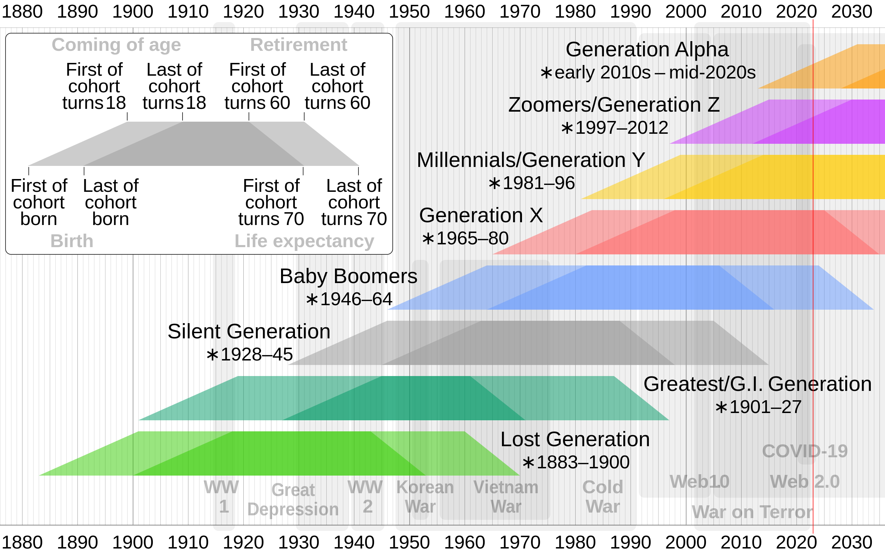

# Age Calculator - Which Generation do you belong to?

This is a Tkinter beginner project.

A simple app that can calculate user's age today and which generation they belong to based on user's input (birth year, month, and day).

Credit image: 

By Cmglee - Own work, CC BY-SA 4.0, https://commons.wikimedia.org/w/index.php?curid=91612069
